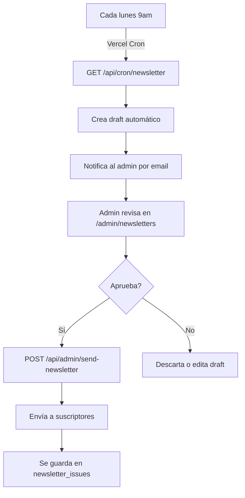

# Guía de Implementación: Blog & Newsletter Notifications
**Full Stack Developer Guide**  
Última actualización: 2026-05-14

---

## 🔧 Variables de Entorno Requeridas

Agregar a `.env.local`:

```env
# Admin notifications
ADMIN_SECRET=tu_admin_secret_key_aqui
CRON_SECRET=tu_cron_secret_key_aqui

# Para Vercel Cron (Newsletter automático)
# (Ya debe estar en .env.local)
```

---

## 📋 PASO 1: Ejecutar SQL en Supabase (ORDEN IMPORTANTE)

### **1A. PRIMERO: Ejecutar schema base**
1. Ir a Supabase → Tu proyecto → SQL Editor
2. Crear nueva query
3. Copiar contenido de `supabase-schema.sql`
4. Ejecutar

**Esto crea las tablas base:**
- `subscribers`
- `user_profiles`
- `blog_posts`
- `herramientas`
- `empleos`
- `eventos`
- `agentic_projects`
- `aprende_tracks`

### **1B. DESPUÉS: Ejecutar tablas de notificaciones**
1. Crear NUEVA query
2. Copiar contenido de `supabase-notifications.sql`
3. Ejecutar

**Esto crea las tablas de notificaciones:**
- `newsletter_issues` - Histórico de newsletters publicados
- `newsletter_drafts` - Borradores del newsletter
- `notification_history` - Historial de notificaciones
- Columna `notify_newsletter` en `subscribers`

**⚠️ IMPORTANTE:** Ejecutar supabase-schema.sql PRIMERO, luego supabase-notifications.sql

---

## 📧 PASO 2: Blog Notifications (Enviar email cuando publicas un blog)

### **Para Admin Blog:**

En el futuro cuando tengamos admin panel de blog (`/admin/blog`), agregar:

```tsx
import { useState } from "react";
import SendNotificationModal from "@/components/admin/SendNotificationModal";

export default function BlogAdminPage() {
  const [showNotifyModal, setShowNotifyModal] = useState(false);
  const [selectedBlog, setSelectedBlog] = useState<Blog | null>(null);

  const handlePublishAndNotify = (blog: Blog) => {
    setSelectedBlog(blog);
    setShowNotifyModal(true);
  };

  return (
    <div>
      {/* Lista de blogs */}
      {blogs.map((blog) => (
        <div key={blog.id}>
          <h3>{blog.title}</h3>
          <button onClick={() => handlePublishAndNotify(blog)}>
            Publicar y notificar
          </button>
        </div>
      ))}

      {selectedBlog && showNotifyModal && (
        <SendNotificationModal
          section="blog"
          title={selectedBlog.title}
          url={`/blog/${selectedBlog.slug}`}
          onClose={() => setShowNotifyModal(false)}
          onSuccess={() => {
            // Refetch blogs o actualizar UI
          }}
        />
      )}
    </div>
  );
}
```

### **O usar manualmente:**

```bash
curl -X POST http://localhost:3000/api/admin/send-notification \
  -H "Content-Type: application/json" \
  -H "x-admin-secret: ADMIN_SECRET" \
  -d '{
    "section": "blog",
    "title": "Remesas con USDC en Venezuela",
    "url": "https://defivenezuela.com/blog/remesas-usdc-venezuela"
  }'
```

---

## 📰 PASO 3: Newsletter Automático (Cada lunes 9am)

### **Configuración en Vercel:**

1. `vercel.json` ya está creado con el cron
2. El cron se ejecuta cada lunes a las 9am UTC

### **Qué sucede automáticamente:**

```
LUNES 9:00 AM (UTC)
↓
GET /api/cron/newsletter (con Authorization header)
↓
1. Crea draft en newsletter_drafts
2. Admin recibe email notificando que hay nuevo draft
3. Admin va a /admin/newsletters
4. Admin revisa y aprueba el contenido
5. Admin click "Enviar a suscriptores"
6. Se envía a todos con notify_newsletter=true
7. Se guarda en newsletter_issues
```

### **Flujo completo:**



---

## 🔐 Seguridad

### **Headers requeridos:**

```
x-admin-secret: [valor de ADMIN_SECRET]
```

### **Autorización del Cron:**

En `vercel.json`, Vercel automáticamente agrega:
```
Authorization: Bearer CRON_SECRET
```

**IMPORTANTE:** Configurar `CRON_SECRET` en Vercel dashboard:
1. Ir a Settings → Environment Variables
2. Agregar `CRON_SECRET=algo_muy_seguro`

---

## 📊 Endpoints Disponibles

### **Enviar Notificación**
```
POST /api/admin/send-notification
Headers: x-admin-secret: ADMIN_SECRET
Body: {
  section: "blog" | "herramientas" | "eventos" | "agentic" | "aprende" | "empleos" | "newsletter",
  title: string,
  url?: string
}
```

### **Historial de Notificaciones**
```
GET /api/admin/notification-history?limit=20&section=blog
Headers: x-admin-secret: ADMIN_SECRET
```

### **Cron Newsletter**
```
GET /api/cron/newsletter
Headers: Authorization: Bearer CRON_SECRET
(Se ejecuta automáticamente cada lunes)
```

---

## 🧪 Testing Local

### **1. Probar endpoint de notificación:**

```bash
# En terminal
curl -X POST http://localhost:3000/api/admin/send-notification \
  -H "Content-Type: application/json" \
  -H "x-admin-secret: tu_admin_secret" \
  -d '{
    "section": "blog",
    "title": "Test Blog",
    "url": "http://localhost:3000/blog/test"
  }'
```

### **2. Probar cron manual:**

```bash
curl -X GET http://localhost:3000/api/cron/newsletter \
  -H "Authorization: Bearer tu_cron_secret"
```

### **3. Verificar en Supabase:**

- Ir a `notification_history` → ver registros creados
- Ir a `newsletter_drafts` → ver borradores
- Ir a `newsletter_issues` → ver publicados

---

## 📧 Flujo de Emails

### **Blog/Herramientas/Eventos (Notificación inmediata)**

```
Trigger: Admin envía notificación
↓
To: Todos con notify_{section}=true
Subject: 🇻🇪 Nuevo en DeFi Venezuela: {title}
Content: HTML profesional con branding
CTA: Botón "Ver ahora" hacia la URL
Footer: Link a /user?tab=notificaciones para cambiar preferencias
```

### **Newsletter (Automático cada lunes)**

```
Trigger: Vercel Cron (lunes 9am)
↓
To: admin@defivenezuela.com
Subject: [ADMIN] Newsletter #{number} lista para revisar
Action: Admin revisa y aprueba en /admin/newsletters
↓
Si aprueba → Envía a todos con notify_newsletter=true
```

---

## 🚀 Deployment Checklist

- [ ] Ejecutar SQL (`supabase-notifications.sql`) en Supabase
- [ ] Agregar `.env.local`:
  - `ADMIN_SECRET=valor_seguro`
  - `CRON_SECRET=valor_seguro`
- [ ] Push a GitHub
- [ ] En Vercel dashboard:
  - [ ] Agregar env vars: `ADMIN_SECRET`, `CRON_SECRET`
  - [ ] Deploy
  - [ ] Verificar que `vercel.json` se cargó correctamente
- [ ] Probar localmente:
  - [ ] `npm run dev`
  - [ ] Probar endpoint con curl
  - [ ] Verificar emails en Resend dashboard
- [ ] Ir a producción ✅

---

## 🐛 Troubleshooting

### **"Unauthorized" error en send-notification**
- Verificar que `x-admin-secret` header sea correcto
- Verificar que `ADMIN_SECRET` esté en `.env.local`

### **Newsletter cron no se ejecuta**
- Verificar que `vercel.json` existe en root
- Verificar en Vercel dashboard → Crons que esté listado
- Revisar logs: `vercel logs` 

### **Emails no se envían**
- Verificar `RESEND_API_KEY` en `.env.local`
- Verificar en Resend dashboard que la API key sea válida
- Revisar logs en `/api/admin/send-notification`

### **Subscribers no reciben notificaciones**
- Verificar en Supabase que existan registros en `subscribers`
- Verificar que `notify_{section}=true` en la tabla
- Revisar que email no esté en lista de no enviables de Resend

---

## 📚 Recursos

- [Resend Email API](https://resend.com)
- [Vercel Crons](https://vercel.com/docs/cron-jobs)
- [Supabase Email](https://supabase.com)
